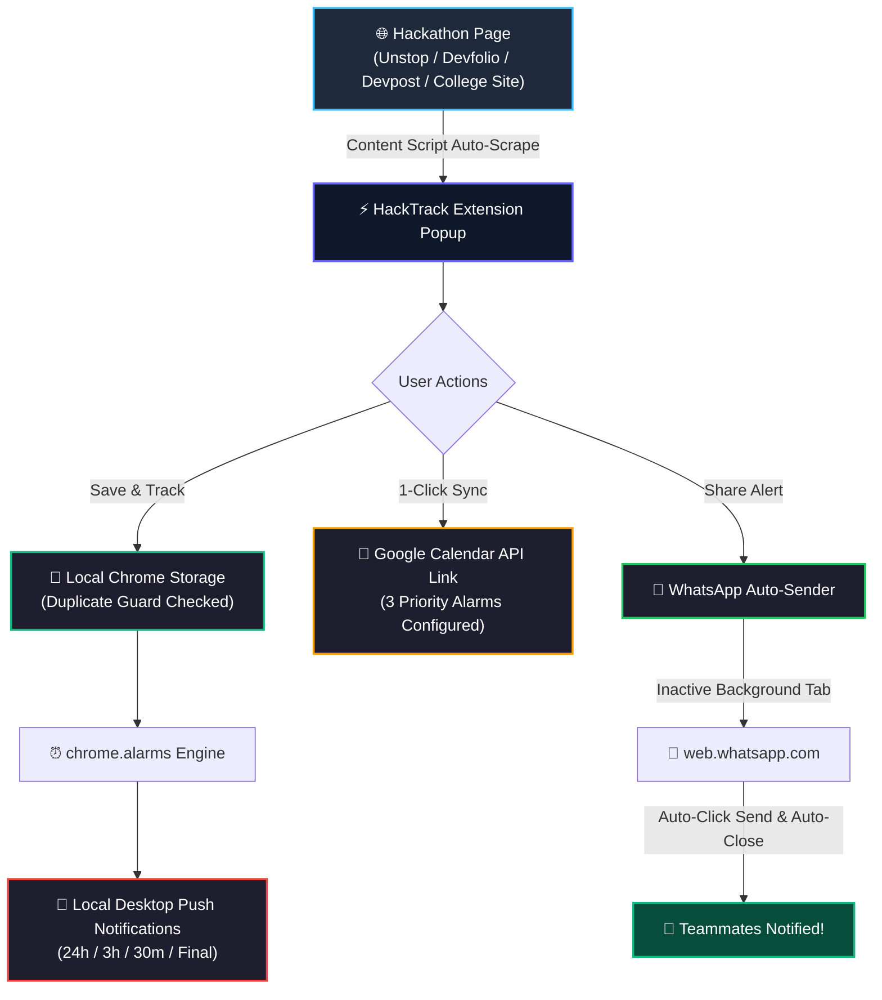

<div align="center">

# ⚡ HackTrack
### *Universal Hackathon Deadline Tracker & Instant Team Alert Engine*

[](https://developer.chrome.com/docs/extensions/mv3/intro/)
[](https://developer.mozilla.org/en-US/docs/Web/JavaScript)
[](https://github.com/Kavin-124/HackTrack)
[](LICENSE)

<br/>

> 🎯 **Never miss a hackathon round, PPT upload, or quiz submission deadline again.**  
> Automatically detect dates, sync with Google Calendar, set 3-tier alarms, and broadcast instant alerts to teammates via WhatsApp!

---

### 🌐 Supported Platforms
| **Platform** | **Supported Features** | **Detection Type** |
| :--- | :--- | :--- |
| 🚀 **Unstop** | Title, Multi-Round Timelines, Quiz & PPT Deadlines | Auto-DOM Parser |
| 💻 **Devfolio** | Hackathon Info, Stage Deadlines, Direct Links | Smart Selector |
| 🌐 **Devpost** | Submission Windows, Project Deadlines | Semantic Search |
| ⚡ **HackerEarth** | Challenge Timelines, Round Dates | Live Page Scanner |
| 🎓 **College Symposiums** | Custom Webpages, Google Forms, Event Pages | Regex & NLP Date Parser |

---

</div>

## 📑 Table of Contents
- [✨ Key Features](#-key-features)
- [🏗️ How It Works (Architecture)](#️-how-it-works-architecture)
- [🖥️ Extension Interface Preview](#️-extension-interface-preview)
- [🚀 Quick Installation (30 Seconds)](#-quick-installation-30-seconds)
- [🛠️ Detailed Feature Breakdown](#️-detailed-feature-breakdown)
  - [1. Universal Auto-Detection](#1-universal-auto-detection)
  - [2. 1-Click Google Calendar Sync (3 Alarms)](#2-1-click-google-calendar-sync-3-alarms)
  - [3. Silent WhatsApp Auto-Sender](#3-silent-whatsapp-auto-sender)
  - [4. Duplicate Prevention Engine](#4-duplicate-prevention-engine)
  - [5. Teammate Contact Manager](#5-teammate-contact-manager)
- [🔒 Privacy & Security Guarantee](#-privacy--security-guarantee)
- [📁 Project Structure](#-project-structure)
- [🤝 Contributing](#-contributing)
- [👤 Author](#-author)

---

## ✨ Key Features

```
┌────────────────────────────────────────────────────────────────────────┐
│  ⚡ SMART AUTO-SCRAPER     ➔ Detects round deadlines & timelines       │
│  📅 CALENDAR SYNC (3-TIER) ➔ 24h, 3h, 30m prior phone alarms           │
│  💬 WHATSAPP AUTO-DISPATCH ➔ Silent background broadcast to teammates  │
│  🛡️ DUPLICATE GUARD        ➔ Blocks redundant bookmarking              │
│  ⏳ LIVE COUNTDOWNS        ➔ Real-time urgent badge highlights         │
│  🔒 100% PRIVATE & LOCAL   ➔ Zero analytics, zero cloud tracking       │
└────────────────────────────────────────────────────────────────────────┘
```

- **Smart Multi-Round Parsing:** Extracts multiple stages (e.g., Round 1: Online Quiz, Round 2: Idea Submission, Round 3: Grand Finale) with Indian/UK standard date format (`DD/MM/YYYY hh:mm AM/PM`).
- **Triple-Alarm Google Calendar Integration:** One click populates Google Calendar with pre-configured notifications at:
  - 🚨 **24 Hours Before** (Buffer time)
  - 🔥 **3 Hours Before** (Critical preparation)
  - ⏰ **30 Minutes Before** (Final PPT / GitHub repo submission)
- **Silent Background WhatsApp Dispatcher:** Automatically opens WhatsApp Web in an inactive background tab, pre-fills formatted team alerts, clicks send, and safely closes the tab without disrupting your browsing.
- **Predefined Teammate Manager:** Save team member names and WhatsApp numbers in Settings for 1-click individual or team-wide broadcasting.
- **Duplicate Prevention:** Intelligently checks existing tracked hackathons and prevents duplicate records while providing one-click access to view existing deadlines.

---

## 🏗️ How It Works (Architecture)



---

## 🖥️ Extension Interface Preview

```
┌────────────────────────────────────────────────────────┐
│  ⚡ HackTrack                     [Tracked: 3] [⚙️]    │
├────────────────────────────────────────────────────────┤
│  🎯 Smart India Innovate Hackathon 2026                │
│  🏷️ Platform: Unstop  |  ⏳ 12d 04h remaining          │
│                                                        │
│  📌 ROUNDS & DEADLINES (DD/MM/YYYY):                   │
│  ┌──────────────────────────────────────────────────┐  │
│  │ 1. PPT Submission       📅 18/10/2026 11:59 PM   │  │
│  │ 2. Prototype Demo       📅 25/10/2026 06:00 PM   │  │
│  │ 3. Grand Finale         📅 02/11/2026 09:00 AM   │  │
│  └──────────────────────────────────────────────────┘  │
│                                                        │
│  [ 💾 Save & Set Reminders ]                           │
│  [ 📅 Google Calendar ]   [ 💬 WhatsApp Team Alert ]   │
└────────────────────────────────────────────────────────┘
```

---

## 🚀 Quick Installation (30 Seconds)

### Step 1: Clone or Download
```bash
git clone https://github.com/Kavin-124/HackTrack.git
```

### Step 2: Load into Browser
1. Open **Google Chrome**, **Brave**, or **Microsoft Edge**.
2. Navigate to `chrome://extensions/` in the URL bar.
3. Turn on the **"Developer mode"** toggle in the top-right corner.
4. Click **"Load unpacked"** (top-left button).
5. Select the cloned `HackTrack` folder.
6. 🎉 **Done!** Pin HackTrack to your toolbar for instant access.

---

## 🛠️ Detailed Feature Breakdown

### 1. Universal Auto-Detection
HackTrack's `content.js` inspects page metadata, JSON-LD schemas, timeline nodes, and heading structures to extract accurate event details without manual typing:
- Unstop date ranges (e.g. `18 Sep 26, 12:00 AM IST → 20 Oct 26, 11:59 PM IST`)
- Handles single submission timestamps and TBA dates gracefully.
- Date format normalized to standard **`DD/MM/YYYY hh:mm AM/PM`**.

### 2. 1-Click Google Calendar Sync (3 Alarms)
Clicking **"Google Calendar"** generates a prefilled event with:
- Full title, event URL, and round descriptions.
- Automated alarms set at:
  - `popup: 1440` (24 Hours)
  - `popup: 180` (3 Hours)
  - `popup: 30` (30 Minutes)

### 3. Silent WhatsApp Auto-Sender
- Message includes hackathon title, rounds breakdown, urgency badge, and submission link.
- Automatically handles phone number prefixing (`+91` / international format).
- Operates via a silent background tab (`active: false`), clicks send upon rendering, and auto-closes the tab within 1.5 seconds.

### 4. Duplicate Prevention Engine
- Compares incoming page URLs and titles against stored active events.
- Displays an inline warning badge: `⚠️ Already Tracked` with a direct shortcut to view the existing entry in the **"My Tracked"** dashboard.

### 5. Teammate Contact Manager
- Configure frequently contacted hackathon buddies in **Settings**.
- Quick individual recipient selection or **Broadcast to All Teammates** with one click.

---

## 🔒 Privacy & Security Guarantee

HackTrack was built with a **strict privacy-first philosophy**:

- 🛡️ **Zero External Servers:** Everything runs 100% locally in your browser. No telemetry, analytics, or third-party tracking scripts.
- 💬 **WhatsApp Web Security:** The auto-sender script **ONLY** targets the specific pre-filled send button (`button[aria-label="Send"]`). It **never reads, inspects, or accesses** your private chats, messages, media, or contact list.
- 🔐 **End-to-End Encryption:** WhatsApp Web's native end-to-end encryption remains completely untouched.
- 📱 **User Control:** You can disconnect WhatsApp Web at any time directly from your mobile device via `Settings > Linked Devices`.

---

## 📁 Project Structure

```text
HackTrack/
├── manifest.json                 # Manifest V3 Extension Manifest
├── icons/                        # Extension Icons (16px, 48px, 128px)
│   ├── icon16.png
│   ├── icon48.png
│   └── icon128.png
├── popup/                        # Extension User Interface
│   ├── popup.html                # Modern Popup Layout & Modals
│   ├── popup.css                 # Dark theme, Glassmorphism & Urgency Styling
│   └── popup.js                  # Dynamic controller, Storage, Calendar & WA Logic
├── scripts/                      # Core Execution Engines
│   ├── content.js                # Multi-platform DOM Scraper & Date Extractor
│   ├── background.js             # Service Worker: chrome.alarms & Desktop Notifications
│   └── whatsapp-auto-send.js     # Silent Background WhatsApp Web Sender
├── demo_unstop_page.html         # Interactive Test Bed (Mock Unstop Page)
├── .gitignore                    # Git ignore configurations
└── README.md                     # Comprehensive Visual Documentation
```

---

## 🤝 Contributing

Contributions, feature suggestions, and bug reports are warmly welcome!
1. Fork the Project (`https://github.com/Kavin-124/HackTrack/fork`)
2. Create your Feature Branch (`git checkout -b feature/AmazingFeature`)
3. Commit your Changes (`git commit -m 'Add some AmazingFeature'`)
4. Push to the Branch (`git push origin feature/AmazingFeature`)
5. Open a Pull Request

---

## 👤 Author

**Kavin**
- GitHub: [@Kavin-124](https://github.com/Kavin-124)
- Project: [HackTrack Extension](https://github.com/Kavin-124/HackTrack)

---

<div align="center">
⭐ <i>If HackTrack helped you win or submit to your hackathon on time, give it a star on GitHub!</i> ⭐
</div>
